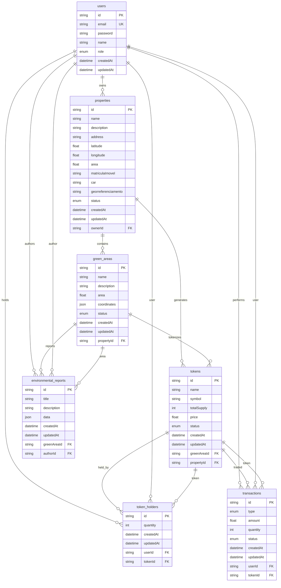

# Diagrama Entidade-Relacionamento - TokenVerde

## 📊 DER do Banco de Dados

## 🔑 Enums Utilizados

### UserRole
- `ADMIN` - Administrador do sistema
- `INVESTIDOR` - Investidor que compra tokens
- `PROPERTY_OWNER` - Proprietário de terras

### PropertyStatus
- `PENDING` - Aguardando aprovação
- `APPROVED` - Aprovada
- `REJECTED` - Rejeitada
- `ACTIVE` - Ativa
- `INACTIVE` - Inativa

### GreenAreaStatus
- `ACTIVE` - Ativa
- `INACTIVE` - Inativa
- `UNDER_AUDIT` - Em auditoria

### TokenStatus
- `ACTIVE` - Ativo
- `INACTIVE` - Inativo
- `PAUSED` - Pausado

### TransactionType
- `BUY` - Compra
- `SELL` - Venda
- `TRANSFER` - Transferência

### TransactionStatus
- `PENDING` - Pendente
- `COMPLETED` - Concluída
- `FAILED` - Falhou
- `CANCELLED` - Cancelada

## 📋 Observações do Schema

### Chaves Primárias
- Todas as entidades usam `id` como chave primária (tipo `string` com `@default(cuid())`)

### Chaves Estrangeiras
- `properties.ownerId` → `users.id`
- `green_areas.propertyId` → `properties.id`
- `tokens.greenAreaId` → `green_areas.id`
- `tokens.propertyId` → `properties.id`
- `token_holders.userId` → `users.id`
- `token_holders.tokenId` → `tokens.id`
- `transactions.userId` → `users.id`
- `transactions.tokenId` → `tokens.id`
- `environmental_reports.greenAreaId` → `green_areas.id`
- `environmental_reports.authorId` → `users.id`

### Constraints Especiais
- `users.email` - Único
- `token_holders` - Unique constraint em `[userId, tokenId]`
- `properties` - Coordenadas obrigatórias (latitude/longitude)
- `green_areas` - Coordenadas em formato JSON para polígonos
- `tokens` - Vinculado tanto à área verde quanto à propriedade

### Campos de Auditoria
- Todas as entidades principais possuem `createdAt` e `updatedAt`
- Timestamps automáticos com `@default(now())` e `@updatedAt`
